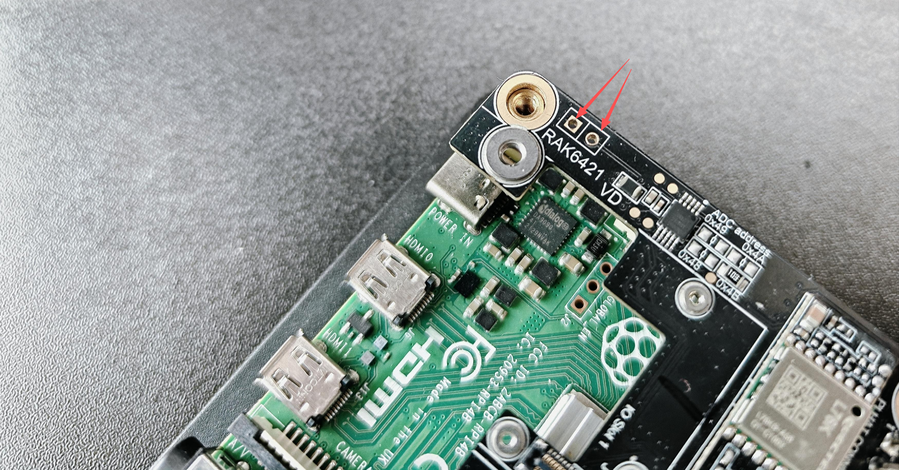

# RAK6421 Pi HAT EEPROM Flashing Guide

This guide explains how to write the HAT EEPROM on a RAK6421 Pi HAT and verify that it was written correctly.

## What Is Raspberry Pi HAT+?

`HAT` means **Hardware Attached on Top**. A Raspberry Pi HAT/HAT+ is an add-on board that can identify itself to the Pi through an EEPROM (usually at I2C address `0x50`).

When EEPROM data is valid, Raspberry Pi OS can read details such as:
- vendor and product name
- product ID and version
- custom fields (for example hardware version or slot/module mapping)

Those values appear under `/proc/device-tree/hat/`.

## Important Warnings Before You Start

- **Power off first** before changing any jumper/short.
- **You must short the EEPROM write-enable pins** on the RAK6421 to allow writing.
- If write-enable is not shorted, the flash command can look successful but the EEPROM content is not actually updated.
- After flashing, remove the short again if you want normal write protection behavior.

## Prerequisites

- Raspberry Pi OS running on the target Pi.
- Basic terminal access (`ssh` or local terminal).
- Required commands available: `eepmake`, `eepflash.sh`, `eepdump`, `i2cdetect`, `python3`.
- This repository cloned on the Pi

Quick check:

```bash
which eepmake eepflash.sh eepdump i2cdetect python3
```

## Step 1: Enable I2C Bus 0 (Required)

The HAT EEPROM is on I2C bus `0`. If bus `0` is not enabled, EEPROM at `0x50` will not be detected.

Edit Raspberry Pi config and make sure these lines are present in your `/boot/firmware/config.txt`:

```ini
dtparam=i2c_vc=on
dtoverlay=i2c0
```

Then reboot:

```bash
sudo reboot
```

## Step 2: Confirm EEPROM Is Visible at `0x50`

After reboot:

```bash
i2cdetect -y 0
```

Expected output includes `50` in the `0x50` row, similar to:

```text
     0  1  2  3  4  5  6  7  8  9  a  b  c  d  e  f
00:                         -- -- -- -- -- -- -- --
10: -- -- -- -- -- -- -- -- -- -- -- -- -- -- -- --
20: -- -- -- -- -- -- -- -- -- -- -- -- -- -- -- --
30: -- -- -- -- -- -- -- -- -- -- -- -- -- -- -- --
40: -- -- -- -- -- -- -- -- -- -- -- -- -- -- -- --
50: 50 -- -- -- -- -- -- -- -- -- -- -- -- -- -- --
60: -- -- -- -- -- -- -- -- -- -- -- -- -- -- -- --
70: -- -- -- -- -- -- -- --
```

If `0x50` is missing, fix I2C config first before flashing.

## Step 3: Prepare EEPROM Content File

Edit `RAK-6421-eeprom.txt` for your board:

- `product_id`, `product_ver`, `vendor`, `product`
- `custom_data` lines such as:
  - `custom_data "hardware_version D"`
  - `custom_data "io_slot1 RAK13302"`

Notes:
- Use format `custom_data "field value"` (space separator, no colon).
- Keep comments starting with `#`.
- Keep `product_uuid` as all zeroes if you want `eepmake` to auto-generate a UUID.

## Step 4: Enable Write (Hardware Short)

Before writing EEPROM:

1. Power off the Pi.
2. Short the EEPROM write-enable pins on the RAK6421.

   

3. Power on the Pi.

Do not skip this step.

## Step 5: Flash + Verify (Recommended Script)

Run from repository root:

```bash
python3 flash-eeprom-and-check.py
```

The script performs:
1. `eepmake RAK-6421-eeprom.txt RAK-6421-eeprom.eep`
2. `eepflash.sh -y -w -f=RAK-6421-eeprom.eep -t=24c32`
3. read-back + parse verification against the config file
4. JSON result output with PASS/FAIL status per field

You can also pass sudo password as argument:

```bash
python3 flash-eeprom-and-check.py '<sudo-password>'
```

## Manual Flashing (Without the Script)

If you prefer to run the commands yourself instead of using `flash-eeprom-and-check.py`, follow these steps. The same prerequisites apply (I2C bus 0 enabled, write-enable pins shorted, etc.).

### 1. Generate the binary EEPROM file

Use `eepmake` to convert your text config into a binary `.eep` file:

```bash
eepmake RAK-6421-eeprom.txt RAK-6421-eeprom.eep
```

If you use a different config file or output name:

```bash
eepmake <your-config>.txt <output>.eep
```

### 2. Write to the EEPROM

Use `eepflash.sh` to write the binary image. The RAK6421 uses a 24c32 EEPROM:

```bash
sudo eepflash.sh -y -w -f=RAK-6421-eeprom.eep -t=24c32
```

- `-y` skips confirmation prompts
- `-w` means write (use `-r` for read)
- `-f=` specifies the file
- `-t=24c32` specifies the EEPROM type

### 3. (Optional) Read back and verify

To manually verify what was written:

```bash
# Read EEPROM to a file
sudo eepflash.sh -y -r -f=verify.eep -t=24c32

# Dump binary to human-readable text
eepdump verify.eep verify.txt

# Inspect the result
cat verify.txt
```

Then compare `verify.txt` with your `RAK-6421-eeprom.txt` to confirm the values match.

### 4. Reboot and check device-tree

Reboot the Pi, then inspect what the OS sees:

```bash
cat /proc/device-tree/hat/
cat /proc/device-tree/hat/custom_0
cat /proc/device-tree/hat/custom_1
```

---

## Troubleshooting Checklist

- `i2cdetect -y 0` does not show `50`
  - confirm `dtparam=i2c_vc=on` and `dtoverlay=i2c0`
  - reboot and test again
- flash command reports success but values do not change
  - write-enable pins were not shorted (most common issue)
- verification mismatch in script output
  - check `custom_data` formatting and spelling in `RAK-6421-eeprom.txt`
  - reflash with write-enable short in place
